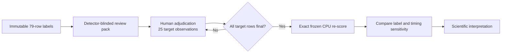

# Spon Ca Burst hard-ROI adjudication v1

> [!IMPORTANT]
> **Status: waiting for blinded human adjudication.** The review materials and
> frozen evaluation mechanics are ready, but every reported hard-ROI finding
> remains provisional until the 25 target observations are finalized.

[Workflow](../workflows/spon_ca_burst_hard_roi_adjudication.md) ·
[Completion audit](SPON_CA_BURST_HARD_ROI_ADJUDICATION_V1_COMPLETION_AUDIT.md)

## Executive snapshot

| Area | Current state |
| --- | --- |
| Original labels | Preserved: 79 rows; SHA-256 unchanged |
| Review material | 4 blinded clips, 4 overlays, 25 raw-trace plots |
| Target observations | 25 total: 11 provisional notes, 14 pending |
| Frozen evaluation | Mechanics validated at budgets 20/40/58/80/100 |
| Model fitting | None |
| GPU use | None |
| Scientific release gate | Human adjudication plus final exact re-score |



## Why this checkpoint exists

Yinong’s frame-level review suggested three distinct issues that should not be
collapsed into a generic “model miss”:

1. **Identity ambiguity:** ROI 010 and ROI 015 may describe one overlapping
   neuron.
2. **Timing mismatch:** several burst-2 neurons may activate before the nominal
   detection interval.
3. **Morphology uncertainty:** visible flashes do not always establish a clear
   neuronal boundary, especially for ROI 007, 008, 017, and 020.

The workflow therefore separates anatomical identity, activity confidence,
observation-specific timing, and detector failure mode. It does not tune the
detector against these known failures.

## Completed materials

### Blinded review pack

```text
Outputs/HardROIAdjudication/spon_ca_burst_hard_roi_adjudication_v1
```

- Four padded H.264 clips spanning all bursts
- Raw intensity, fixed pseudo-color, and positive-change panels
- Neutral ROI boxes without scores or recovered/missed status
- Four projection overlays
- A 79-row observation-level adjudication draft
- Immutable input hashes and resource/preflight evidence

### Timing and morphology aid

```text
Outputs/HardROIAdjudication/spon_ca_burst_hard_roi_review_checklist_v2
```

The aid contains 25 raw center-minus-annulus trace plots and a compact reviewer
worksheet. Its timing suggestions are conservative and detector-independent.
They are prompts for review—not automatic labels.

### Exact mechanics preview

```text
Outputs/HardROIAdjudication/spon_ca_burst_hard_roi_rescore_exact_causal_preview_v1
```

The preview reconstructs the promoted causal features deterministically from
the immutable carrier. It is explicitly marked `provisional_preview`.

## Reproduction landmarks

Original labels with original timing produced the following macro recall:

| Frozen lane | B20 | B40 | B58 | B80 | B100 |
| --- | ---: | ---: | ---: | ---: | ---: |
| Carrier | 0.5409 | 0.6572 | 0.7031 | 0.7156 | 0.7264 |
| `coherence_w15` | 0.6053 | 0.6764 | 0.7223 | 0.7223 | 0.7451 |
| standalone `propagation_lag2_w15` | 0.6220 | 0.6806 | 0.7498 | 0.7617 | 0.7726 |

> [!NOTE]
> These values validate the evaluation mechanics. They do not validate the
> provisional labels. The standalone lag lane is also not interchangeable with
> the scientific audit’s cross-fitted all-family selector.

## Provisional diagnostic picture

| ROI | Frozen evaluator signal | Interpretation to review |
| --- | --- | --- |
| 010 / 015 | Centers are 3.171 px apart, inside the 6 px match/NMS radius | Plausible canonical merge; requires anatomical confirmation per occurrence |
| 014 | Approximately 6.91 px from the frozen point label | Likely localization sensitivity; early burst-2 timing remains plausible |
| 019 | Approximately 7.71 px from the frozen point label | Subtle response plus localization sensitivity |
| 017, burst 2 | Rank 78 at budget 58 | Evidence exists below the fixed candidate budget |
| 023, bursts 3–4 | Local evidence suppressed by 6 px NMS | NMS interaction rather than a uniform proposal absence |
| 007 | Mixed match, relaxed localization, and NMS outcomes | Morphology should determine confirmed versus activity-only status |

These observations describe frozen detector behavior. They must not influence
the blinded anatomical/activity judgments.

## Human decision queue

The reviewer should finalize all 25 rows, including the 11 rows already seeded
from the email as provisional notes:

- Confirm or reject the ROI 010/015 canonical merge for each relevant burst.
- Resolve ROI 007 and ROI 023 across their remaining occurrences.
- Decide whether ROI 008, 017, and 020 show defensible neuronal identities.
- Accept or replace onset/peak/end timing where early activation is visible.
- Record reviewer identity and timestamp.
- Save the completed table under a new versioned filename.

> [!WARNING]
> Targeted review is conditioned on known misses. It cannot estimate precision,
> turn unmatched candidates into negatives, or replace exhaustive review of a
> bounded calibration field.

## Final release command

After the adjudication gate passes, run the quantitative CPU path into a new
output root:

```bash
.venv-neurobench/bin/python \
  -m neurobench.experiments.hard_roi_adjudication.exact_rescore_cli \
  --config examples/spon_ca_burst_hard_roi_adjudication_v1.example.json \
  --adjudication-tsv /path/to/final_adjudication.tsv \
  --output-dir Outputs/HardROIAdjudication/spon_ca_burst_hard_roi_rescore_final_v1
```

The final report should compare label-view sensitivity and timing-view
sensitivity separately, then explain shifts among identity conflict, proposal,
ranking, NMS, localization, and temporal failure classes.
