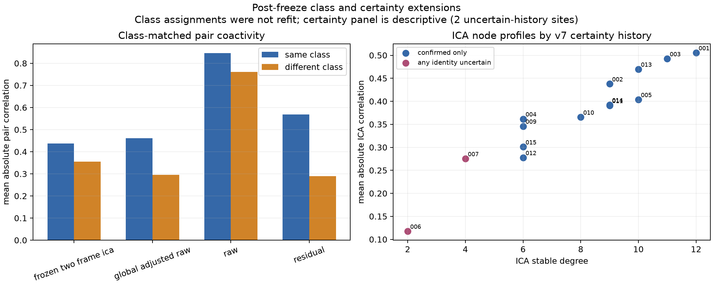

# Cross-Neural Class and Certainty Review

## Result in one sentence

Pairs assigned to the same frozen measurement class were more strongly
coactive than pairs assigned to different classes in all four representations,
including frozen ICA; identity-certainty network differences are visually
interesting but too sparse for inference.

## Class assortativity

Frozen classes were matched to the 14 complete trace sites independently in
each burst using the approved six-pixel rule. Forty-six of 56 site-by-burst
records matched, producing 243 evaluable pair-by-burst observations: 111
same-class and 132 different-class.

| Representation | Same class | Different class | Difference | Burst-preserving permutation p |
|---|---:|---:|---:|---:|
| Raw | 0.846 | 0.761 | +0.085 | 0.0297 |
| Residual | 0.568 | 0.290 | +0.278 | 0.00010 |
| Global-adjusted Raw | 0.461 | 0.296 | +0.165 | 0.00060 |
| Frozen two-frame ICA | 0.437 | 0.356 | +0.081 | 0.00460 |

Values are mean absolute event-window correlations. Permutations shuffle
frozen class labels among matched sites within each burst, preserving burst
composition. Classes were not refit and ICA was not used to create them.

The result supports a post-freeze association between measurement class and
coactivity structure. The stronger separation after residualization suggests
that class alignment is not explained only by the global Raw burst waveform.
Because the classes arise from detector candidates and the same recording, the
association remains candidate-assisted and within-recording.

## Certainty alignment

Only ROI 006 and ROI 007 among the 14 complete sites have any v7
identity-uncertain occurrence. Both appear at the low-degree, low-mean-ICA-
correlation end of the descriptive node plot. This is a useful targeted-review
observation, but a two-site group does not support a stable group comparison or
network-based identity claim. No certainty p-value was calculated.

## Current decision boundary

Suitable manuscript language after confirmatory sensitivity checks:

> Frozen measurement classes aligned with within-recording coactivity structure
> across Raw, nuisance-adjusted, and frozen ICA representations.

Not supported:

- classes identify anatomical subnetworks;
- ICA edges are independent neural sources;
- uncertainty is caused or predicted by low network participation;
- coactivity establishes wiring, synapses, or causal direction.
