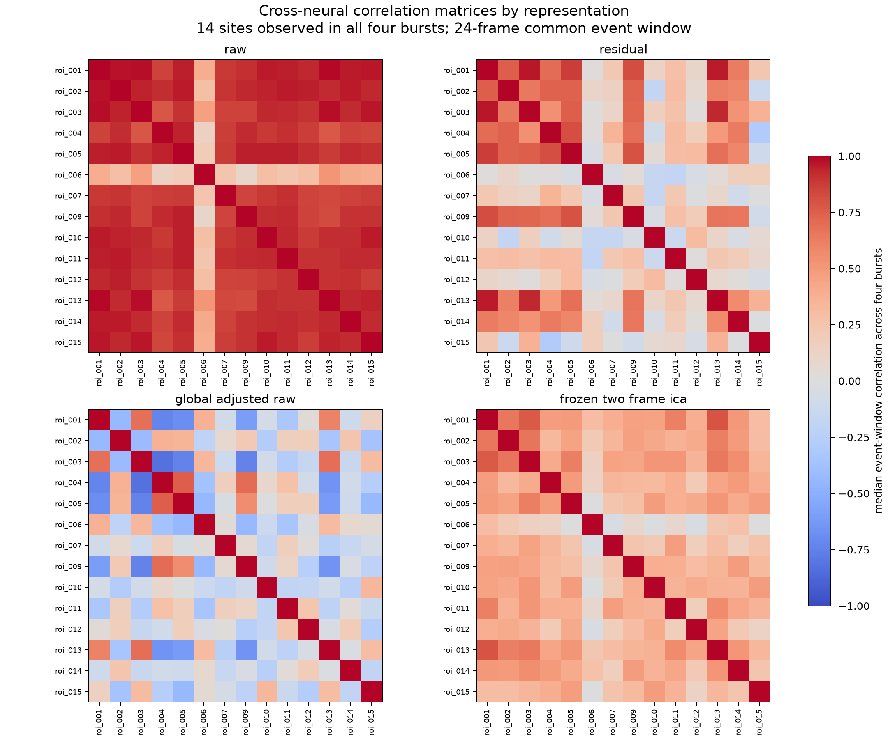
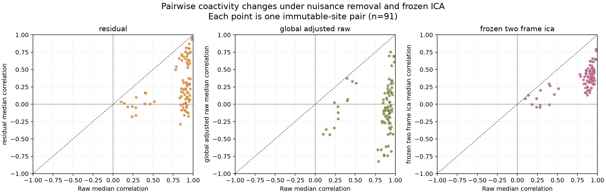
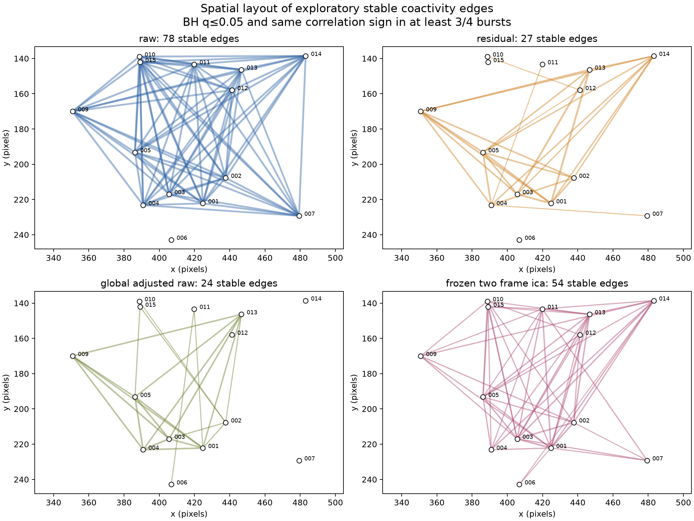

# Cross-Neural Coactivity with Frozen ICA: Exploratory Review

## The immediate result

Four representations were compared using exactly the same 14 immutable sites,
four bursts, 24-frame event windows, and 91 site pairs. The frozen ICA operator
was hash verified and was not refit using labels.

| Representation | Median absolute pair correlation | Exploratory stable edges |
|---|---:|---:|
| Raw | 0.907 | 78 / 91 |
| ROI-minus-annulus residual | 0.213 | 27 / 91 |
| Leave-one-site-out global-adjusted Raw | 0.209 | 24 / 91 |
| Frozen two-frame ICA | 0.381 | 54 / 91 |

An exploratory stable edge requires a two-sided circular-shift BH-adjusted
`q <= 0.05` and the same correlation sign in at least three of four bursts.

## Figure 1 — Matched correlation matrices

Raw activity is almost uniformly correlated. Much of that density disappears
after local or recording-wide nuisance adjustment. ICA is intermediate: it
retains substantial synchronized temporal-change structure without simply
reproducing the Raw correlation magnitudes.

## Figure 2 — What changes relative to Raw

Each point is the same site pair. The ICA pair pattern remains related to Raw
(`r=0.692` across pairs), more strongly than residual (`r=0.374`) or
global-adjusted Raw (`r=0.142`). This is compatible with a shared onset/change
signal. It does not identify independent neuronal sources.

## Figure 3 — Spatial network views

Raw produces an almost saturated graph. The nuisance-adjusted graphs are much
sparser and therefore more useful for selecting pair-level examples and future
controls. ICA retains 54 exploratory edges; 52 overlap Raw edges.

## Current interpretation

The recording contains a strong shared burst response. Local residualization
and global adjustment show that a substantial fraction of Raw coactivity is
not pair specific. Frozen ICA retains an intermediate network consistent with
synchronized temporal change. This makes ICA scientifically meaningful in the
cross-neural analysis, while reinforcing its interpretation as a change
operator rather than an automatically independent biological source.

## What is not established

- anatomical wiring or synapses;
- causal direction or leader/follower neurons;
- population generalization beyond this recording;
- a confirmatory network threshold;
- class or certainty assortativity, which is the next post-freeze extension.

The within-window circular-shift null is exploratory. Any promoted edge or
network statistic requires a higher-resolution, burst-preserving confirmatory
null and sensitivity to event-window and identity choices.
