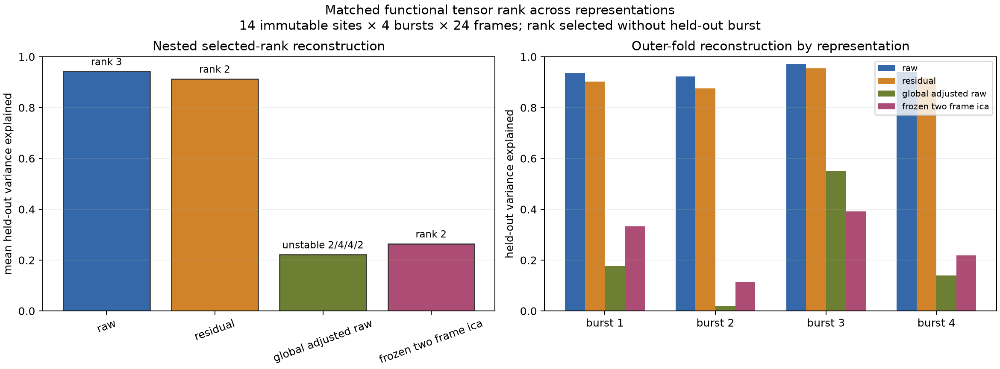

# Multi-Representation Tensor Review

## Main result

The earlier Raw rank-3 result does not transfer unchanged across measurement
representations. A matched nested leave-one-burst-out analysis gives:

| Representation | Selected ranks by held-out burst | Gate | Mean held-out variance explained |
|---|---|---:|---:|
| Raw | 3 / 3 / 3 / 3 | Pass, stable rank 3 | 0.942 |
| Residual | 2 / 2 / 3 / 2 | Pass, stable rank 2 | 0.913 |
| Global-adjusted Raw | 2 / 4 / 4 / 2 | Fail, unstable | 0.221 |
| Frozen two-frame ICA | 2 / 2 / 2 / 3 | Pass, stable rank 2 | 0.264 |

All representations used the same 14 immutable sites, four bursts, 24-frame
windows, candidate ranks 1--4, eight seeds, and nested rank-selection rule.

## Interpretation

Raw contains a highly reproducible three-component representation. Local
annulus subtraction removes one reproducible dimension while preserving strong
rank-2 reconstruction, suggesting compact spatially localized structure remains
after local common-mode removal.

Global adjustment removes most reproducible low-rank waveform structure and
produces unstable rank selection. This is evidence that much of Raw's rank-3
structure depends on recording-wide shared activity, but it does not prove that
the removed component was purely artifact; global adjustment can also remove
real coordinated neural recruitment.

Frozen ICA has stable rank-2 selection in three of four folds but low held-out
reconstruction. It captures reproducible change-oriented structure, yet does
not preserve most event-waveform variance. This agrees with its established
interpretation as a temporal-change operator rather than an amplitude-
preserving independent neural source.

## Manuscript-safe conclusion

> Functional complexity depended strongly on representation: Raw activity had
> stable rank-3 structure, local residuals retained strongly reconstructive
> rank-2 structure, whereas global-adjusted and frozen-ICA representations had
> substantially lower held-out reconstruction.

The tensor factors remain descriptive. They are not neurons, anatomical
subnetworks, causal sources, or evidence of generalization beyond this
recording.
