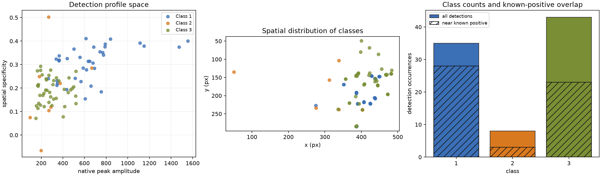
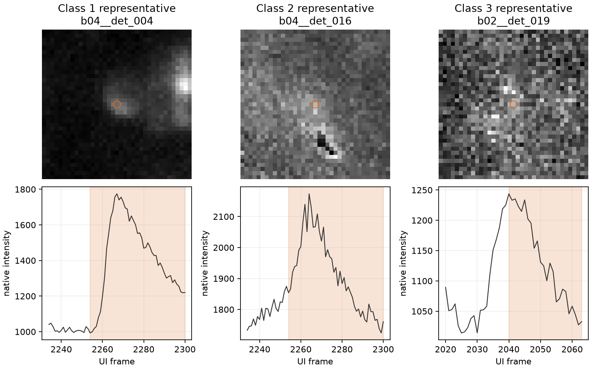
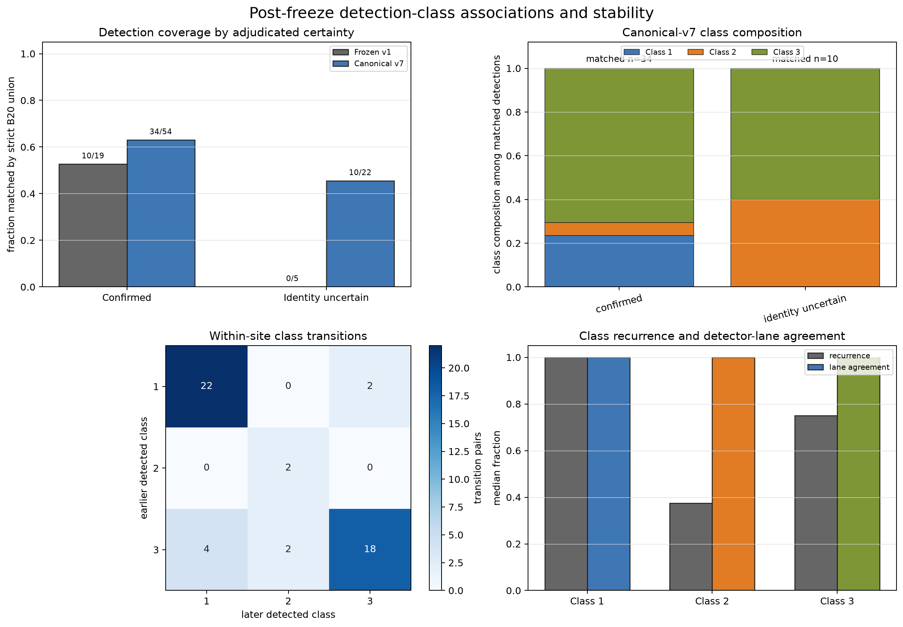
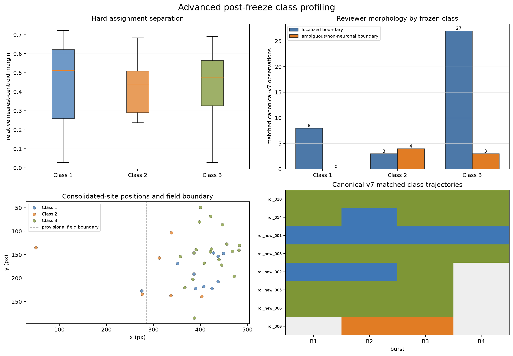

# Detection-Profile Classes: Author Review

## Two-minute summary

We found **86 detector occurrences at 36 consolidated spatial sites**. A
label-free analysis froze three recurring measurement-event classes:

1. **Class 1 — localized, high-signal, recurrent:** 35 occurrences at 12 sites.
2. **Class 2 — broad, low-signal, early/episodic:** 8 occurrences at 6 sites.
3. **Class 3 — broad, lower-signal, recurrent:** 43 occurrences at 24 sites.

The classes recur across bursts and sites. They also align meaningfully with
reviewer morphology and identity certainty. They are **measurement classes, not
neuron types**, and sparse-label overlap is **not precision**.

## What I recommend approving

- Use **detection-event measurement classes** as the biological level of language.
- Describe Class 1 as **localized, high-signal, and recurrent**.
- Describe Class 2 as **broad, low-signal, and early/episodic**.
- Describe Class 3 as **broad, lower-signal, and recurrent**.
- State that identity uncertainty aligns with class composition, but not with
  geometric class-assignment ambiguity.
- Keep the field-position result supplementary and explicitly fragile.
- Never translate sparse known-positive proximity into precision, specificity,
  false-positive rate, or biological cell type.

## Figure 1 — What the three classes look like globally



How to read it:

- The left panel shows the amplitude/specificity profile space.
- The middle panel shows where detections occur in the image.
- The right panel shows class sizes and post-freeze proximity to sparse known
  positives. Hatched overlap is descriptive and is not precision.

What matters:

- Class 1 occupies the localized, higher-amplitude region.
- Classes 2 and 3 have broadly similar amplitude but differ in timing,
  recurrence, and contextual characteristics.

## Figure 2 — Representative event from each class



The upper row shows event-maximum minus baseline image crops. The lower row shows
the native trace with the event window shaded. These are centroid-nearest
examples, not hand-selected best or worst cases.

Review question: **Do these examples look consistent with the three class names?**

## Figure 3 — Certainty alignment and within-site stability



### Identity certainty

- Frozen v1 matched 10/19 confirmed observations and 0/5 identity-uncertain
  observations. This is suggestive but small-sample (`p=0.053`).
- Canonical v7 matched 34/54 confirmed and 10/22 identity-uncertain observations;
  overall coverage was not clearly different (`p=0.203`).
- Among matched v7 observations, confirmed Classes 1/2/3 were **8/2/24**;
  uncertain Classes 1/2/3 were **0/4/6**.

Interpretation: uncertainty aligns more with **which measurement regime appears**
than with whether anything is detected.

### Stability

- 42/50 ordered within-site transitions remained in the same class: **84%**.
- Class 1 persisted in 22/24 transitions.
- Class 3 persisted in 18/24 transitions.
- Class 2 persisted in 2/2 transitions, but this class is small.

Interpretation: the classes are recurring measurement regimes, while occasional
switches caution against treating them as immutable site or neuron types.

## Figure 4 — Morphology, field position, and canonical trajectories



### Class-assignment ambiguity

Confirmed and identity-uncertain observations had similar nearest-centroid
margins (`p=0.790`). Identity uncertainty is therefore not simply caused by an
event lying between two class centers. The margin is geometric, not a calibrated
probability.

### Reviewer morphology and context

- Localized-boundary morphology produced Classes 1/2/3 in counts of **8/3/27**.
- Ambiguous or non-neuronal boundary morphology produced **0/4/3**.
- Challenging or structured contexts contained no Class 1 matches.
- Overlapping contexts were Class 3 in this matched sample.

These candidate-assisted associations support the class descriptions but do not
independently validate them.

### Spatial position

The spatial comparison uses the **36-site grain**, so recurrent detections do not
count repeatedly. Only three sites were left of the provisional `x=286` boundary:
one Class 1 site, two Class 2 sites, and no Class 3 sites. The site-label
permutation value was `p=0.041`, but the denominator is too sparse and the
boundary too provisional for an anatomical conclusion.

### Canonical trajectories

Twenty-four canonical identities were matched to classes; eight appeared in at
least two bursts. Their median dominant-class fraction was 1.0. ROI 014 and
ROI-new-002 changed class in one burst and are useful targeted review cases.

## Exact author decisions requested

**Author status (2026-08-24): all seven items are tentatively approved as
written.** These are working decisions for the current analysis and manuscript,
not final publication approval. The machine-readable record is in
`TENTATIVE_AUTHOR_DECISIONS.yaml`.

Please respond with **Approve** or revised wording for each item:

1. **Measurement-class language:** The three groups are detection-event
   measurement classes, not neuron types.
2. **Certainty language:** Identity uncertainty aligns with class composition,
   but not with centroid-assignment ambiguity.
3. **Class 1 name:** Localized, high-signal, recurrent.
4. **Class 2 name:** Broad, low-signal, early/episodic.
5. **Class 3 name:** Broad, lower-signal, recurrent.
6. **Field result:** Retain only as a fragile, hypothesis-generating,
   supplementary observation.
7. **Positive-unlabeled boundary:** Sparse overlap must not be called precision,
   specificity, or false-positive rate.

Copy/paste response:

```text
1. Approve / revise:
2. Approve / revise:
3. Approve / revise:
4. Approve / revise:
5. Approve / revise:
6. Approve / revise:
7. Approve / revise:
Additional comments:
```

## Optional deeper review

Only review these if you want to inspect borderline assignments or exceptions:

- `sources/AMBIGUOUS_CLASS_REVIEW.tsv` — 22 lowest-margin occurrences.
- ROI 014 — Class sequence 3 → 1 → 3 → 3.
- ROI-new-002 — Class sequence 1 → 1 → 3.
- ROI 006 — uncertain identity with Class 2 in both matched bursts.

Reviewing these examples does not change the frozen taxonomy. Any refit would be
a separately versioned analysis.

## Evidence boundary

This package supports a within-recording methodological profile. It does not
establish biological cell types, causal mechanisms, exhaustive full-field
performance, or cross-recording generalization. Canonical-v7 morphology and
certainty analyses are candidate-assisted and hypothesis-generating.
