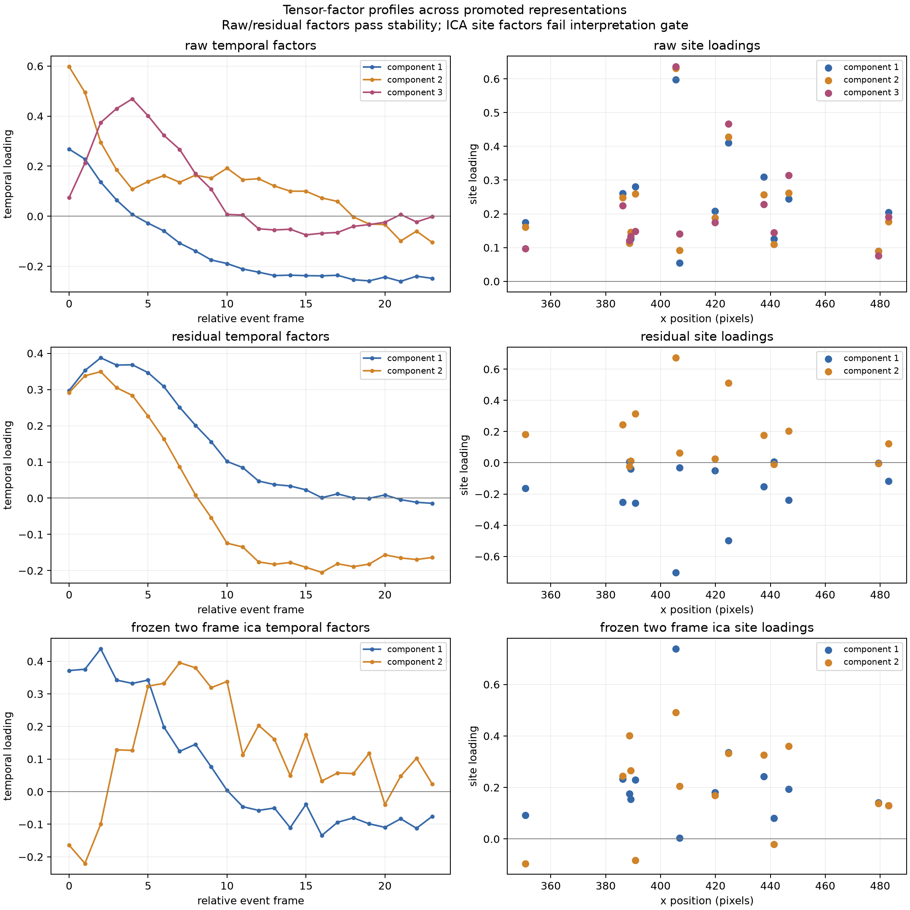

# Tensor Factor Profile Review

## Stability first

The Raw rank-3 and residual rank-2 site factors were highly reproducible across
leave-one-burst-out fits: mean aligned site-loading correlations were
0.964--0.979. Their temporal and site profiles may therefore be described as
stable within this recording.

The two ICA site factors had stability values of only 0.598 and 0.487. ICA's
overall rank-2 representation remains valid for reconstruction comparisons, but
its individual components cannot be reliably named or biologically interpreted.
Global-adjusted Raw was excluded because its preceding rank-stability gate
failed.

## What the stable profiles show

- Raw contains three reproducible temporal shapes: a sustained signed contrast,
  an early-decaying component, and an early transient peaking around relative
  frame 4.
- Residual activity separates into two reproducible shapes. Both rise early;
  one returns toward baseline while the other changes sign and remains
  negative later in the window.
- Spatial-position correlations of the loadings were modest. No factor supports
  a strong anatomical field interpretation.

## Class and certainty alignment

Residual component 2 had the strongest nominal class association
(`eta^2=0.553`, permutation `p=0.0247`). After correcting across all seven
component tests, its BH value was `q=0.152`; it is therefore descriptive, not a
confirmed class-specific factor. No component passed the multiplicity-adjusted
class test.

Only two complete sites have identity-uncertain history, so certainty remains a
targeted site-level observation rather than an inferential factor comparison.

## Manuscript-safe conclusion

> Raw and locally residualized activity contained reproducible temporal factors,
> but no individual factor showed multiplicity-adjusted alignment with the
> frozen measurement classes. Although frozen ICA had stable rank-2 complexity,
> its individual site factors were not stable across held-out bursts.

These factors are descriptive representation components, not neurons,
subnetworks, synapses, or causal sources.
